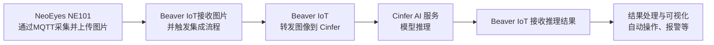

import useBaseUrl from '@docusaurus/useBaseUrl';

# Beaveriot Integration

## 什么是Beaver IoT？

Beaver IoT是一个为快速直观的物联网应用开发设计的开源平台。它支持从设备连接到数据处理、分析和可视化的整个过程。此外，Beaver IoT支持物联网开发者利用项目封装能力快速构建各种集成，是物联网原型设计和可扩展解决方案的理想选择。Beaver IoT在物联网领域促进创新和社区协作。
- [Beaver IoT Github](https://github.com/Milesight-IoT/beaver-iot)
- [Beaver IoT Docs](https://www.milesight.com/beaver-iot/docs/user-guides/introduction/)

## 安装Beaver IoT
Beaver IoT的安装详情请参阅[安装指南](https://www.milesight.com/beaver-iot/docs/user-guides/installation)


## 如何在Beaver IoT中使用Cinfer
Beaver IoT安装完成后会在「集成」中内置Cinfer服务，你可以在这里填入Cinfer的Token信息来在Beaver IoT中请求Cinfer上的模型，并绑定设备与操作 ，详见：[Cinfer集成使用](https://www.milesight.com/beaver-iot/docs/user-guides/published-integrations/camthink-ai-inference-service)


### 配置Cinfer集成


点击集成卡片进入集成配置界面，填写Cinfer服务的IP地址和Token来连接服务，关于服务地址和Token的获取可以自行部署Cinfer服务，详见[Cinfer-Quick-Start](../0-quick-start.md)，或者你可以联系CamThink官方渠道获取Cinfer云服务的Token来快速体验，在准备好这些信息后，你可以通过下方的「Save」按钮来保存信息，如果服务正常则集成设置上方状态会显示“连接中”。

### 查看和测试Cinfer模型

进入Service Management菜单，这里会显示Cinfer当前此Token可用的所有模型，你可以通过「Refresh Models」按钮来请求刷新当前模型列表，列表中可点击你需要测试的模型进行图片上传测试，点击对应模型按钮后，弹窗填写AI推理请求参数，点击「Upload」上传本地图片或者点击「URL」输入目标图片在线地址，在下方中填写请求的其他参数，点击下方的按钮进行图像推理。


### 将设备绑定所需的AI模型进行推理
点击Binding Devices菜单，进入管理界面，此功能逻辑为绑定对应设备使其上报的图片数据自动根据绑定的Cinfer模型进行请求，Beaver IoT会将此设备的每一次图像数据上报更新送入Cinfer服务的对应模型中获取AI推理结果并根据结果绘制图像并保存对应结果数据，以实现“设备图像采集上报->Beaver IoT->Cinfer推理->Beaver IoT数据处理”的完整链路，此功能仅支持具有图像数据的设备，[CamThink NeoEyes NE101](../../../2-neoeyes-ne101-series/0-overview.md) 支持此集成进行图像数据绑定。


## Cinfer、Beaver IoT与NeoEyes NE101 深度集成示例

### 集成流程

NeoEyes NE101、Beaver IoT 和 Cinfer 服务之间深度集成的数据和操作流程示意图：


### 设备连接

通过Beaver IoT集成中心的MQTT Device Integrated来设置MQTT服务，通过设置设备模版对设备上报的数据转变为Beaver IoT中的实体数据，关于MQTT Device Integrated如何使用可见[MQTT Device Integrated](https://www.milesight.com/beaver-iot/zh-Hans/docs/user-guides/published-integrations/mqtt-devices-integrated)，下方会介绍你如何配置MQTT Device Integrated以用于接入NeoEyes NE101用于接收设备传送的数据。
#### 1.添加模板
打开Beaver IoT的集成页面选择MQTT Device Integrated集成插件，进入设备模板管理页面后点击+添加。
为该模板定义唯一的名称后，设置一个设备主题用于接收设备的上行数据并点击复制图标保存该主题。
配置设备模板和备注等信息后，点击确认保存模板。

关于NeoEyes NE101的模版yaml文件可复制下方内容后在使用添加模版时使用
```yaml
definition:
  input:
    type: object
    properties:
      - key: ts                 # json key
        type: long                   # data type
        entity_mapping: 'ts'
      - key: values       # json key
        type: object
        properties:
          - key: devName               # json key
            type: string 
            entity_mapping: 'devName' # data type
            is_device_name: true
          - key: devMac               # json key
            type: string                   # data type
            entity_mapping: 'devMac'  # entity identifier
          - key: devSn               # json key
            type: string                   # data type
            entity_mapping: 'devSn'  # entity identifier
          - key: hwVersion                  # json key
            type: string                    # data type
            entity_mapping: 'hwVersion'     # entity identifier
          - key: fwVersion                  # json key
            type: string                    # data type
            entity_mapping: 'fwVersion'     # entity identifier
          - key: battery                  # json key
            type: long                    # data type
            entity_mapping: 'battery'     # entity identifier
          - key: batteryVoltage                  # json key
            type: long                    # data type
            entity_mapping: 'batteryVoltage'     # entity identifier
          - key: snapType                  # json key
            type: string                    # data type
            entity_mapping: 'snapType'
          - key: imageSize                  # json key
            type: long                    # data type
            entity_mapping: 'imageSize'
          - key: image                 # json key
            type: string                    # data type
            entity_mapping: 'image'
          - key: devSn                  # json key
            type: string                    # data type
            entity_mapping: 'device_id'
            is_device_id: true
  output:
    type: object
    properties:
      - key: device_id                 # json key
        type: string                   # data type
        entity_mapping: 'device_id'    # entity identifier
      - key: temperature               # json key
        type: double                   # data type
        entity_mapping: 'temperature'  # entity identifier
      - key: humidity                  # json key
        type: double                   # data type
        entity_mapping: 'humidity'     # entity identifier
      - key: status                    # json key
        type: long                     # data type
        entity_mapping: 'status'       # entity identifier
      - key: time                      # json key
        type: string                   # data type
        entity_mapping: 'time'         # entity identifier
initial_entities:
  - identifier: 'ts'
    name: 'ts'
    value_type: long
    type: property
    access_mod: R
  - identifier: 'devName'
    name: 'device_name'
    value_type: string
    type: property
    access_mod: R
  - identifier: 'devMac'
    name: 'dev_mac'
    value_type: string
    type: property
    access_mod: R
  - identifier: 'devSn'
    name: 'dev_sn'
    value_type: string
    type: property
    access_mod: R
  - identifier: 'hwVersion'
    name: 'hw_version'
    value_type: string
    type: property
    access_mod: R
  - identifier: 'fwVersion'
    name: 'fw_version'
    value_type: string
    type: property
    access_mod: R
  - identifier: 'battery'
    name: 'battery'
    value_type: long
    type: property
    access_mod: R
  - identifier: 'batteryVoltage'
    name: 'battery_voltage'
    value_type: long
    type: property
    access_mod: R
  - identifier: 'snapType'
    name: 'snap_type'
    value_type: string
    type: property
    access_mod: R
  - identifier: 'device_id'
    name: 'device_id'
    value_type: string
    type: property
    access_mod: R
  - identifier: 'imageSize'
    name: 'image_size'
    value_type: long
    type: property
    access_mod: R
  - identifier: 'image'
    name: 'image'
    value_type: string
    type: property
    access_mod: R
    attributes:
      format: IMAGE:BASE64
```
添加完成后你可在列表中见到此设备模版，因此我们需要进一步配置设备，保证其与Beaver IoT可正确连接，或者你可以通过MQTT Device Integrated自带的模拟功能来模拟NE101上报的数据，你可以对列表中对应模版操作栏的「Test」按钮进行点击，或者你可以点击「Edit」按钮进行信息修改。


#### 2.NeoEyes NE101连接到Beaver IoT
此处需要设置NeoEyes NE101配置页上的MQTT服务地址为MQTT Device Integrated中的MQTT服务地址，先在MQTT Device Integrated中获取到MQTT服务地址（需要保证设备可访问到此地址），你可以在集成中获取并服务MQTT服务信息，并通过NeoEyes NE101的配置页面设置进行修改，**请保证NE101可访问外部网络，或者与部署Beaver IoT的服务存在同一个网络环境中**。
#### 2.1 在MQTT Device Integrated中获取MQTT服务信息

#### 2.2 将MQTT信息设置更新到NE101，硬件详细配置使用说明可见[「NE101 Quick Start」](../../../2-neoeyes-ne101-series/1-quick-start.md)
<div style={{ display: 'grid', gridTemplateColumns: '1fr', gap: '20px', justifyContent: 'center', alignItems: 'center' }}>
  
</div>

### 图像识别
#### 1.使用NeoEyes NE101抓取图像
确认上述配置完成后，可通过NeoEyes NE101设备的抓拍按钮或定时拍摄任务设置来向Beaver IoT发送图像数据。
#### 2.查看Beaver IoT的设备列表
若设置正确，NE101上报数据成功可以在Beaver IoT的Device菜单内看到设备，并且在设备详情中可以看到设备上报的数据转换为实体数据，其中包含图像数据。


#### 3.Cinfer模型绑定NE101设备
在Cinfer集成中将此设备绑定需要使用的模型，例如你部署的NE101用于采集水表数据，你需要通过Beaver IoT对此图像进行图像数据分析与识别，可以通过Cinfer集成来配置设备绑定的对应AI模型，在Cinfer集成中可新增绑定设备，选择设备，选择设备下的图片实体数据，并且选择所需要绑定的Cinfer模型名称Beaver IoT会自行自动化任务，每一张上传的图像都会根据所绑定的模型送入数据到Cinfer进行识别，并且将识别后的图像进行绘制和识别后的结果转化为设备的新数据实体。


#### 4.查看NE101上报的图像以及经过Cinfer推理的数据结果
若整体数据链路正常，之后通过MQTT上报数据到Beaver IoT的NE101设备如果有绑定具体的模型可在设备绑定列表中查询到此设备，以及设备的每一次上报数据的推理结果数据，你可以点击在绑定列表中的操作列的详情按钮进行数据浏览


### 应用开发
关于如何基于BeaverIoT进行应用开发，比如Dashboard的构建、工作流的使用、用户管理、集成开发等内容，可详见[「Beaver IoT Dev Guide」](https://www.milesight.com/beaver-iot/docs/dev-guides/key-dev-concept)