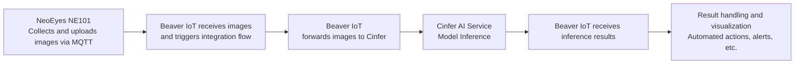

import useBaseUrl from '@docusaurus/useBaseUrl';

# Beaveriot Integration

## What is Beaver IoT?

Beaver IoT is an open-source platform designed for fast and intuitive IoT application development. It supports the entire process from device connectivity to data processing, analysis, and visualization. In addition, Beaver IoT enables IoT developers to quickly build various integrations through project packaging capabilities, making it an ideal choice for IoT prototyping and scalable solutions. Beaver IoT fosters innovation and community collaboration in the IoT field.
- [Beaver IoT Github](https://github.com/Milesight-IoT/beaver-iot)
- [Beaver IoT Docs](https://www.milesight.com/beaver-iot/docs/user-guides/introduction/)

## Installing Beaver IoT
For detailed installation instructions, please refer to the [installation guide](https://www.milesight.com/beaver-iot/docs/user-guides/installation)

## How to Use Cinfer in Beaver IoT
After installing Beaver IoT, the Cinfer service is built into the "Integrations" section. Here, you can enter the Cinfer Token information to request models on Cinfer from within Beaver IoT, and bind devices and operations. For more details, see: [Cinfer Integration Usage](https://www.milesight.com/beaver-iot/docs/user-guides/published-integrations/camthink-ai-inference-service)


### Configuring Cinfer Integration


Click the integration card to enter the integration configuration screen. Enter the Cinfer service IP address and Token to connect to the service. You can either deploy your own Cinfer service to obtain the service address and Token (see [Cinfer-Quick-Start](../0-quick-start.md)), or contact CamThink official channels to get the Cinfer cloud service Token for a quick experience. Once you have this information, you can save it by clicking the "Save" button below. If the service is functioning properly, the status at the top of the integration settings will display "Connecting".

### View and Test Cinfer Models

Enter the Service Management menu, where all Cinfer models currently available for this Token will be displayed. You can click the "Refresh Models" button to refresh the model list. Models in the list can be selected for image upload testing. After clicking the relevant model button, a pop-up window will appear to fill in AI inference request parameters. Click "Upload" to upload a local image or click "URL" to input a remote image address. Fill in the other parameters below as required, then click the button below to perform image inference.


### Bind Devices to Required AI Models for Inference
Click on the Binding Devices menu to enter the management interface. This feature binds the related device so its uploaded image data is automatically sent for inference using the bound Cinfer model. Beaver IoT will send each image data upload from the device to the corresponding Cinfer model to get AI inference results, then draw images and save results according to the inference for a complete chain: "Device image acquisition & upload -> Beaver IoT -> Cinfer Inference -> Beaver IoT Data Processing." This feature only supports devices with image data. [CamThink NeoEyes NE101](../../../2-neoeyes-ne101-series/0-overview.md) supports binding for image data with this integration.


## Deep Integration Example: Cinfer, Beaver IoT, and NeoEyes NE101

### Integration Process

The following diagram illustrates the data and operation workflow for deep integration between NeoEyes NE101, Beaver IoT, and Cinfer service:


### Device Connection

Use MQTT Device Integrated in Beaver IoT's Integration Center to set up the MQTT service. Configure device templates to convert device-uploaded data into Beaver IoT's entity data. For details on using MQTT Device Integrated, see [MQTT Device Integrated](https://www.milesight.com/beaver-iot/zh-Hans/docs/user-guides/published-integrations/mqtt-devices-integrated). Below is how to configure MQTT Device Integrated for connecting NeoEyes NE101 and receiving its transmitted data.
#### 1. Add a Template
Open the Beaver IoT integration page, select the MQTT Device Integrated plugin, enter the device template management page, and click "+ Add".
Define a unique name for this template, set a device topic for receiving device uplink data, and click the copy icon to save the topic.
Configure the device template and notes, then click confirm to save the template.

You can copy the following yaml file for NeoEyes NE101 when adding a template:
```yaml
definition:
  input:
    type: object
    properties:
      - key: ts                 # json key
        type: long                   # data type
        entity_mapping: 'ts'
      - key: values       # json key
        type: object
        properties:
          - key: devName               # json key
            type: string 
            entity_mapping: 'devName' # data type
            is_device_name: true
          - key: devMac               # json key
            type: string                   # data type
            entity_mapping: 'devMac'  # entity identifier
          - key: devSn               # json key
            type: string                   # data type
            entity_mapping: 'devSn'  # entity identifier
          - key: hwVersion                  # json key
            type: string                    # data type
            entity_mapping: 'hwVersion'     # entity identifier
          - key: fwVersion                  # json key
            type: string                    # data type
            entity_mapping: 'fwVersion'     # entity identifier
          - key: battery                  # json key
            type: long                    # data type
            entity_mapping: 'battery'     # entity identifier
          - key: batteryVoltage                  # json key
            type: long                    # data type
            entity_mapping: 'batteryVoltage'     # entity identifier
          - key: snapType                  # json key
            type: string                    # data type
            entity_mapping: 'snapType'
          - key: imageSize                  # json key
            type: long                    # data type
            entity_mapping: 'imageSize'
          - key: image                 # json key
            type: string                    # data type
            entity_mapping: 'image'
          - key: devSn                  # json key
            type: string                    # data type
            entity_mapping: 'device_id'
            is_device_id: true
  output:
    type: object
    properties:
      - key: device_id                 # json key
        type: string                   # data type
        entity_mapping: 'device_id'    # entity identifier
      - key: temperature               # json key
        type: double                   # data type
        entity_mapping: 'temperature'  # entity identifier
      - key: humidity                  # json key
        type: double                   # data type
        entity_mapping: 'humidity'     # entity identifier
      - key: status                    # json key
        type: long                     # data type
        entity_mapping: 'status'       # entity identifier
      - key: time                      # json key
        type: string                   # data type
        entity_mapping: 'time'         # entity identifier
initial_entities:
  - identifier: 'ts'
    name: 'ts'
    value_type: long
    type: property
    access_mod: R
  - identifier: 'devName'
    name: 'device_name'
    value_type: string
    type: property
    access_mod: R
  - identifier: 'devMac'
    name: 'dev_mac'
    value_type: string
    type: property
    access_mod: R
  - identifier: 'devSn'
    name: 'dev_sn'
    value_type: string
    type: property
    access_mod: R
  - identifier: 'hwVersion'
    name: 'hw_version'
    value_type: string
    type: property
    access_mod: R
  - identifier: 'fwVersion'
    name: 'fw_version'
    value_type: string
    type: property
    access_mod: R
  - identifier: 'battery'
    name: 'battery'
    value_type: long
    type: property
    access_mod: R
  - identifier: 'batteryVoltage'
    name: 'battery_voltage'
    value_type: long
    type: property
    access_mod: R
  - identifier: 'snapType'
    name: 'snap_type'
    value_type: string
    type: property
    access_mod: R
  - identifier: 'device_id'
    name: 'device_id'
    value_type: string
    type: property
    access_mod: R
  - identifier: 'imageSize'
    name: 'image_size'
    value_type: long
    type: property
    access_mod: R
  - identifier: 'image'
    name: 'image'
    value_type: string
    type: property
    access_mod: R
    attributes:
      format: IMAGE:BASE64
```
After adding, you will see this device template in the list. We need to further configure the device to ensure it connects with Beaver IoT correctly. Alternatively, you can use the built-in simulation function of MQTT Device Integrated to simulate the reporting behavior of NE101. Click the "Test" button in the operations column of the corresponding template, or click the "Edit" button to modify information.


#### 2. Connect NeoEyes NE101 to Beaver IoT
You need to set the MQTT service address on the NeoEyes NE101 configuration page to the MQTT service address from MQTT Device Integrated. First, obtain the MQTT service address from MQTT Device Integrated (ensure the device can access this address). You can get the MQTT service info from the integration and update the settings on the NE101 configuration page. **Ensure NE101 can access external networks or is on the same network as the Beaver IoT deployment.**
#### 2.1 Obtain MQTT Service Info from MQTT Device Integrated

#### 2.2 Update MQTT Info on NE101. For detailed hardware configuration instructions, see ["NE101 Quick Start"](../../../2-neoeyes-ne101-series/1-quick-start.md)


### Image Recognition
#### 1. Capture Images Using NeoEyes NE101
After completing the above configuration, you can use the capture button or set a scheduled capture task on the NeoEyes NE101 device to send image data to Beaver IoT.
#### 2. View Device List in Beaver IoT
If set up correctly and reporting is successful, you will see the NE101 device in the Device menu in Beaver IoT. The device details will show reported data converted into entity data, including image data.


#### 3. Bind Cinfer Model to NE101 Device
In the Cinfer integration, bind the model you want to use for the device. For example, if NE101 is deployed for water meter data collection, you can use Beaver IoT for image data analysis and recognition. Configure the device, select the associated image entity, and choose the Cinfer model to bind. Beaver IoT will automate the workflow: every uploaded image is sent to Cinfer for recognition based on the bound model, with results mapped to new entity data for the device.


#### 4. View Images Reported by NE101 and Cinfer Inference Results
If the overall data flow is normal, each time NE101 uploads data to Beaver IoT using MQTT and if a model is bound, you can find the device and each upload's inference result in the device binding list. Click the details button in the list to view data.


### Application Development
For details on application development using Beaver IoT—such as Dashboard building, workflow usage, user management, integration development, etc.—see the [Beaver IoT Dev Guide](https://www.milesight.com/beaver-iot/docs/dev-guides/key-dev-concept)